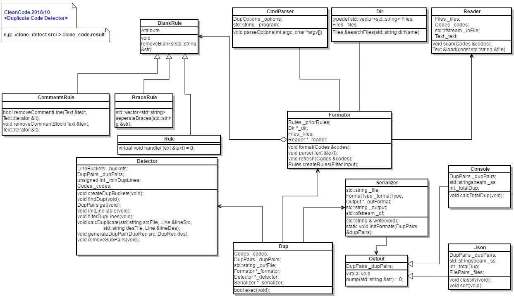

## DupDetector  
```  
To detect duplicaton codes, and generate report to console or json format file.  
```  
## Build  
```  
Notice: To set LD_LIBRARY_PATH if executing clone_detect failure with GLIBCXX not found.  
export LD_LIBRARY_PATH=/opt/gcc/x86_64/4.7.3-6/lib64:$LD_LIBRARY_PATH  
make all  
make ut  
make report(if possible)  
```  
## Run  
```  
e.g: ./clone_detect src -cbn 5 -j json.json  
```  
## Design Diagram  
  
